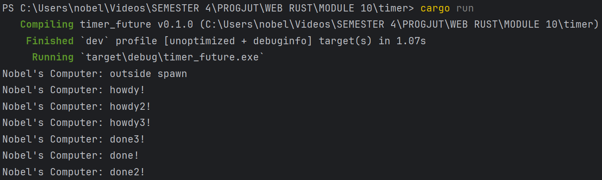

# Modul 10 (Timer)

## 1

Dari gambar di atas, terlihat bahwa pesan Nobel's Computer: outside spawn adalah pesan pertama yang dicetak, kemudian diikuti oleh pesan Nobel's Computer: howdy! dan setelah 2 detik, muncul pesan Nobel's Computer: done!. Hal ini terjadi karena pesan howdy! dan done! merupakan future yang hanya akan dijalankan saat executor dieksekusi. Sementara itu, perintah print untuk pesan outside spawn berada tepat setelah pemanggilan spawner.spawn(...) dan sebelum executor.run(), sehingga perintah tersebut dieksekusi terlebih dahulu dibandingkan dengan print untuk howdy! dan done!.

## 2

Pada gambar diatas, terdapat tiga task yang dijadwalkan menggunakan spawner.spawn(...), masing-masing mencetak pesan awal seperti Nobel's Computer: howdy!, menunggu selama 2 detik menggunakan TimerFuture::new(Duration::new(2, 0)).await, lalu mencetak pesan akhir seperti Nobel's Computer: done!. Setelah ketiga task dijadwalkan, program mencetak Nobel's Computer: outside spawn dan menjalankan executor. Meskipun ketiga spawn dipanggil secara berurutan, urutan output yang muncul (terutama bagian done, done2, dan done3) bisa berbeda-beda setiap kali dijalankan. Hal ini terjadi karena setelah .await, task memasuki keadaan pending dan akan dijadwalkan ulang ketika TimerFuture selesai. Karena ketiga timer memiliki durasi yang sama, semua task siap dilanjutkan secara hampir bersamaan, dan executor akan memproses task berdasarkan antrean internal tanpa menjamin urutan awal. Ini mencerminkan sifat asynchronous dan concurrent dari eksekusi task di Rust.

## 3

Gambar diatas terjadi ketika baris drop(spawner); dihilangkan dari akhir fungsi main, program tidak akan berhenti secara otomatis meskipun semua task telah selesai dijalankan. Hal ini disebabkan oleh cara kerja executor, yang terus menunggu task baru melalui ready_queue.recv(). Selama objek spawner masih ada, channel antara spawner dan executor tetap terbuka. Akibatnya, recv() pada executor tidak pernah mengembalikan Err, sehingga loop di Executor::run() tidak pernah berhenti. Executor akan terus menunggu tanpa mengetahui bahwa tidak ada lagi task yang akan dikirim. Dengan demikian, tanpa drop(spawner), program akan tampak "macet" di akhir, padahal semua task telah selesai—karena executor tidak memiliki sinyal bahwa antrean task sudah ditutup.